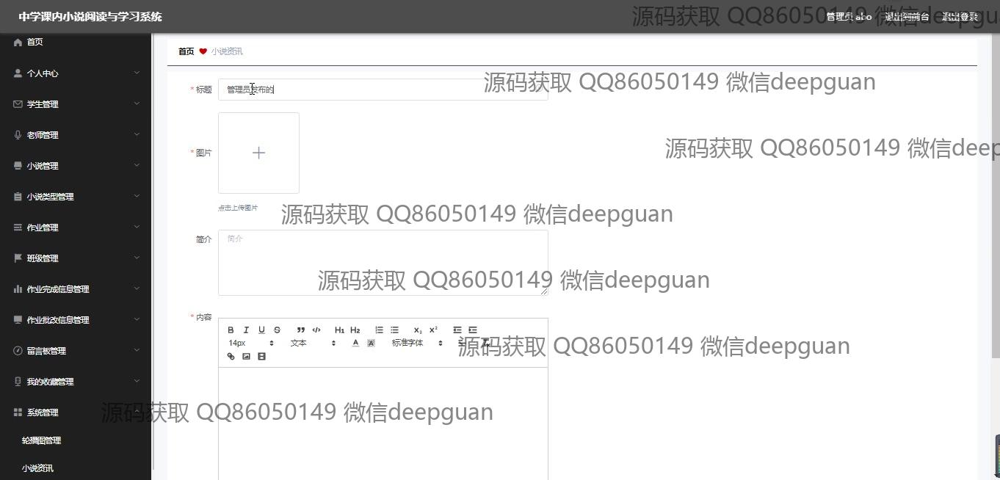
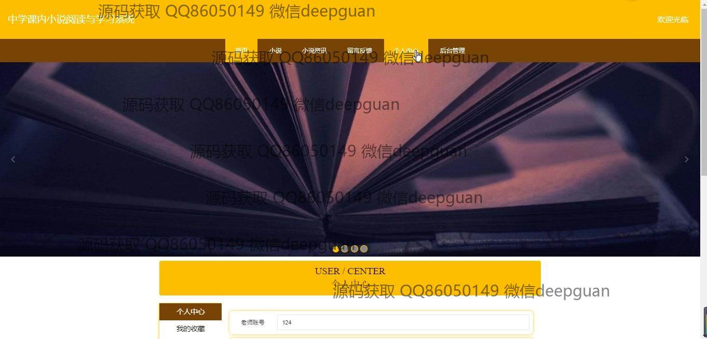
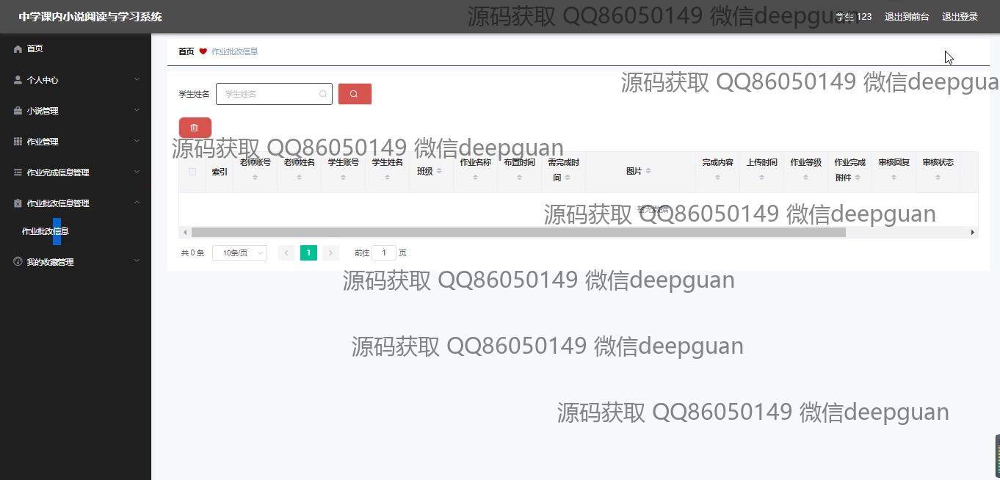

<h1 align="center">基于SSM的中学课内小说阅读与学习系统的设计+vue</h1>

## 简介
中学课内小说阅读与学习系统：角色分为管理员、学生、教师；功能包括小说管理、作业管理、个人信息管理、图像上传、学生注册、留言反馈及用户角色切换。    --计算机毕业设计源码；毕设源码；java毕业设计源码

## 联系方式

<h3 align="center">获取完整代码与数据库文件 + 微信：deepguan QQ: 86050149 QQ群: 783742310</h3>

<h3 align="center">可帮忙远程部署 包运行成功！提供远程部署、修改代码、设计文档指导、代码讲解等服务！</h3>

## 功能介绍（完整见运行截图）
管理员：管理员可以通过系统管理个人信息、学生信息和教师信息，支持对小说信息的创建、编辑和删除，管理作业发布与完成情况，以及查看和导出相关数据。管理界面提供了修改密码、退出登录功能，导航菜单可轻松访问各个功能模块，支持图片上传与内容编辑，便于系统的高效运营与维护。

教师：教师可以管理并录入小说信息，发布、管理及评价学生作业，支持上传附件和设置作业时间。系统允许教师修改个人信息，注册账号时需要输入详细信息如教师编号、联系方式和邮箱。教师也可通过界面对学生作业进行审阅和给出反馈，提升课内小说教学的互动和质量。

学生：学生可以注册登录系统，提交作业，与其他同学或老师交流。个人中心允许学生查看和更新个人信息，包括上传头像功能。学生能通过系统浏览不同小说的详细信息，下载相关资料，完成并上传作业，查看到作业的提交状态及教师的评价。

访客：访客可通过登录界面注册为学生或教师，进入系统进行相关教育活动。注册页面设计简洁，支持快速信息填写和账户创建。此外，系统界面提供简单清晰的导航栏，方便访客在首页浏览小说介绍及教育动态，通过留言反馈功能参与互动交流。

## 运行截图

本代码来源于网络,仅供学习参考使用!

